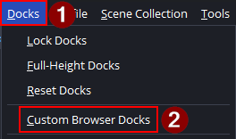
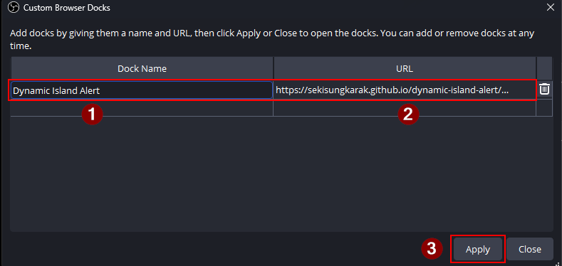
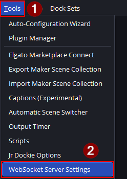
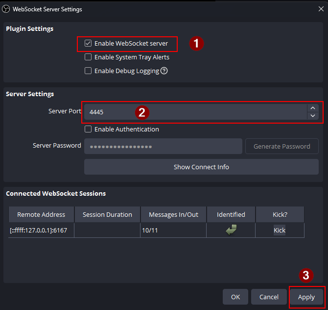
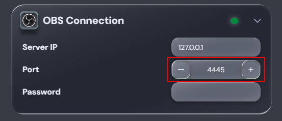
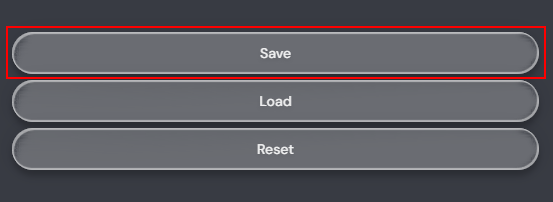
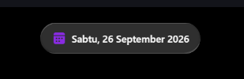
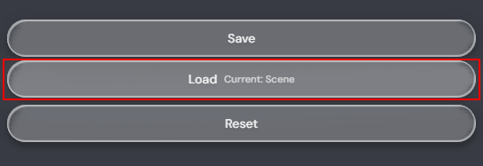
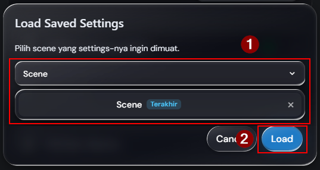

## Kebutuhan

- **OBS Studio 30+** dengan **obs-websocket** bawaan yang aktif.
- Koneksi live TikTok via **TikFinity** atau **IndoFinity** — mana pun yang kamu pakai untuk mengirim event.
- Now Playing via SMTC bridge (https://github.com/nuttylmao/smtc-bridge)

---

## Instalasi

Dashboard dimuat ke OBS sebagai **Custom Browser Dock**. Dari dock itu kamu
mengatur koneksi OBS, lalu tekan **Save** — dashboard akan membuat browser source
untukmu di scene yang sedang aktif.

### Langkah 1 — Tambahkan dashboard dock

1. Di OBS, buka menu atas **Docks → Custom Browser Docks**.
2. Di dialognya, tambahkan satu baris:

   | Field | Value |
   |---|---|
   | **Dock Name** | `Dynamic Island Alert` |
   | **URL** | `https://sekisungkarak.github.io/dynamic-island-alert/dashboard/` |

3. Klik **Apply**, lalu **Close**. Dashboard akan muncul sebagai dock di dalam OBS.





### Langkah 2 — Cek port OBS WebSocket

Dashboard berkomunikasi dengan OBS lewat **obs-websocket**, jadi portnya harus
sama di kedua sisi.

1. Di OBS, buka **Tools → WebSocket Server Settings**.
2. Pastikan **Enable WebSocket server** tercentang, dan catat **Server Port**-nya.
3. Klik **Apply** untuk menyimpan.





### Langkah 3 — Isi OBS Connection

Di dock, buka bagian **OBS Connection** dan masukkan nilai dari server
**obs-websocket milikmu sendiri** — **Port** harus sama dengan angka yang kamu
catat di Langkah 2:

| Field | Value |
|---|---|
| **Server IP** | `127.0.0.1` |
| **Port** | **Server Port** yang sama seperti di Langkah 2 (default `4455`) |
| **Password** | password dari dialog OBS yang sama (biarkan kosong jika nonaktif) |

Titik status akan berubah **hijau** begitu dock terhubung ke OBS. Kalau tetap
merah, port atau password-nya tidak cocok dengan pengaturan OBS WebSocket-mu —
perbaiki di sini sebelum lanjut.



### Langkah 4 — Tekan Save

Klik **Save** di bagian bawah dock. Dashboard lalu membuat **Browser Source** di
**scene yang sedang aktif**, dinamai sesuai scene-nya:

```
{Scene} | Dynamic Island Alert
```

Ukurannya **1080 × 500** dan ditempatkan di **atas-tengah**. Kalau source dengan
nama itu sudah ada, ia diperbarui di tempat, jadi menekan Save lagi tidak akan
membuat duplikat.





> **Tips** — pindah ke scene yang kamu inginkan **sebelum** menekan Save, dan
> tambahkan ke setiap scene yang kamu stream.

### Langkah 5 — Muat pengaturan tersimpan

**Load** menarik kembali konfigurasi tersimpan ke dock untuk scene yang dipilih.

1. Klik **Load Current Scene** di bagian bawah dock.
2. Di dialog **Load Saved Settings**, pilih **Scene** yang pengaturannya ingin
   kamu muat.
3. Klik **Load**.





Gunakan **Reset** untuk mengembalikan semua opsi ke nilai default.
